<p align="center">
  
</p>

# cascade: SOTA time-series foundation models on Bittensor

cascade is building state-of-the-art time-series foundation models (TSFMs) on
Bittensor. We start where the leverage is: **data**. In the first task, the
model is held byte-identical, so the only variable is data quality. Miners
compete by writing the data generators that feed the model — better synthetic
data means better forecasters. The full plan is in the
[technical roadmap](#technical-roadmap).

## Why compete on data

Synthetic data is not cascade's *only* lever, but we believe high-quality
synthetic data is critical for training a time-series foundation model. The
field points the same way: recent models keep winning benchmarks through
better synthetic priors, not better architectures.

- **Chronos-2** (Amazon, 120M) reaches state-of-the-art zero-shot accuracy on
  fev-bench, GIFT-Eval, and Chronos Benchmark II. It was trained heavily on
  *large-scale synthetic* series: Gaussian-process curves,
  trend/seasonality/irregularity mixtures, and random temporal causal graphs
  ([arXiv 2510.15821](https://arxiv.org/abs/2510.15821)). Their
  purely-synthetic ablation, Chronos-2-Synth, stays within about 1 skill point
  of the full model on GIFT-Eval (50.4 vs 51.4) and Chronos Benchmark II
  (46.4 vs 46.6). The authors note this suggests real data "may not even be
  required for effective pretraining."
- **FlowState** (IBM, 9.1M) is the smallest model in GIFT-Eval's top 10 and
  out-forecasts rivals more than 20x its size. It was pretrained in part on
  synthetic series from the CauKer generator
  ([arXiv 2508.05287](https://arxiv.org/abs/2508.05287)).
- **ForecastPFN** was trained purely on a synthetic distribution and was the
  first zero-shot forecaster to beat the then-SOTA with *no* real training
  data at all ([arXiv 2311.01933](https://arxiv.org/abs/2311.01933)).
  TempoPFN ([arXiv 2510.25502](https://arxiv.org/abs/2510.25502)) pushes the
  purely-synthetic recipe further.
- **DynaMix** (NeurIPS 2025) was trained on nothing but a narrow synthetic
  corpus of 34 chaotic dynamical systems. With about 0.1% of Chronos's
  parameters (~10k in total), it still beats Chronos zero-shot on real-world
  traffic and weather data it never saw — a small, well-curated synthetic
  prior beating a much larger real-data model
  ([arXiv 2505.13192](https://arxiv.org/abs/2505.13192)).

The pattern across the leaderboard: the synthetic data distribution does the
heavy lifting. cascade makes that distribution the competition itself. The
model is fixed; miners compete on the prior.

## How it works

### The fixed model

The fixed model is a Toto2-4M backbone
([Datadog/Toto-2.0-4m](https://huggingface.co/Datadog/Toto-2.0-4m),
arXiv 2605.20119), trained from the round's shared init. At generation 0 that
init is random; once the [cascade](#the-cascade-promoted-generations) has
promoted a generation (the live case today), rounds warm-start from the
promoted checkpoint instead. It is *never* a fine-tune of released weights.

This matters: every learned parameter is grown inside the subnet, so the
corpus is the only source of learned signal. The downstream forecast skill
measures the *data*, not what a pretrained checkpoint already knew. Even the
warm-start lineage was produced by the competition itself. Toto 2.0 itself was
pretrained on 57.5% synthetic data with zero public series and still tops
GIFT-Eval — cascade turns that synthetic-prior design into an open
competition.

```mermaid
flowchart TD
    subgraph miner["Miner (no GPU)"]
        gen["generator.py<br/>(DataGenerator)"]
        upload["push to Hippius Hub registry<br/>(OCI) → repo@digest"]
        commit["commit on-chain pointer<br/>metro-v1:gen:hippius:repo@digest"]
        gen --> upload --> commit
    end

    subgraph trainer["Trainer: owner-operated (the GPU boundary)"]
        resolve["resolve commitments before the<br/>12h epoch cutoff → king + field"]
        seeds["derive one shared RoundSeeds<br/>from epoch-boundary block hash<br/>(generation_seed + training_seed)"]
        heat["HEAT: train every challenger<br/>~1h (screen size) → screen<br/>→ top finalist"]
        trainK["FINAL: train king + finalist<br/>from the shared round init at every<br/>throne size (Toto2-4M live)"]
        upK["push ckpts → Hippius Hub registry<br/>logs/metrics → Hippius S3"]
        manifest["sign + publish TrainingManifest<br/>to Hippius S3 (size-tagged ckpt refs + digests)"]
        resolve --> seeds --> heat --> trainK --> upK --> manifest
    end

    subgraph validator["Validator (eval GPU)"]
        gate["verify signature +<br/>matching contract / base-arch digests<br/>(controlled-experiment gate)"]
        eval["pull king + finalist ckpts per size →<br/>score on shared held-out windows<br/>(CRPS/MWSQL + MASE)"]
        koth["paired-bootstrap LCB of<br/>geomean(CRPS, MASE) POOLED across sizes,<br/>finalist vs king → one KOTH verdict"]
        weights["geometric-decay weights<br/>(king + prior kings)"]
        gate --> eval --> koth --> weights
    end

    commit -->|on-chain| resolve
    manifest -->|S3 manifest + registry ckpts| gate

    classDef invariant fill:#fff3cd,stroke:#d39e00,color:#5c4400;
    class seeds,gate invariant;
```



> The highlighted boxes are where the controlled experiment lives: the trainer
> reuses one `RoundSeeds` for every run in the round, and the validator's
> digest gate rejects any manifest where king and challenger didn't share that
> contract. Details below.

### The round cadence

A round is one ~12h epoch (`[round] epoch_blocks`; it was 24h until
2026-07-28). The trainer runs exactly one round per epoch, so the king is
retrained twice a day. All trainings in a round share one `RoundSeeds` — the
same init, whether random or the promoted cascade warm-start.

Only generators whose on-chain pointer *revealed* strictly before the epoch
boundary compete in that round. The deploy command defaults to a timed reveal
targeting just before the boundary (docs/MINER.md §5a); a reveal that lands
late rolls into the next round.

Each round has two stages:

1. **Heat** — a cheap screen. Every eligible challenger trains for
   `[round] heat_train_hours` (~1h, at `screen_size`), and the owner screens
   the field down to the top `[round] finalists`.
2. **Final** — the king and the surviving finalist train to the full
   `[training] target_train_hours` (~3h) at every configured `throne_sizes`
   entry.

The shipped config runs the 4M size alone. The 22M rung is a built but dormant
seam (a commented-out `[[training.sizes]]`) that Phase 2 arms.

### The controlled experiment

The central invariant: within a round, the king's generator and the
challenger's generator are trained into models under a *byte-identical*
contract at each size. Same Toto2 architecture, identical init (random at
generation 0, the promoted cascade checkpoint after — see
[the cascade](#the-cascade-promoted-generations)), same compute budget,
optimiser, generation seed, and training seed. The only difference is the
generator code. That makes the downstream eval a controlled measurement of
data quality — not a mix of data, luck, and hyperparameters.

Because each run starts from noise, the contract pins the *whole* recipe (see
`chain.toml [training]`, with per-size overrides in `[[training.sizes]]`).
Each model trains for a fixed wall-clock budget (~3h on the owner's reference
GPU), enforced as a fixed token count (`hours × reference throughput`) so
king and challenger get identical compute. A raw timer would let a generator
win by emitting cheap-to-step data instead of better data — and it would not
reproduce on a re-derived audit run.

### Scoring and the throne

The throne is decided on the **combined** score across sizes. The validator
pools the king-vs-finalist per-window scores from every `throne_sizes` entry
into one paired bootstrap, so there is a single king judged across the whole
size ladder — a scaling-aware king-of-the-hill, not a per-size leaderboard.
(With only the 4M live today, that is a single-size duel; the pooling seam is
what Phase 2 arms.)

A challenger takes the throne by winning `dethrone_cp` round(s) (shipped: 1)
by a confidence-bounded margin: the paired-bootstrap LCB must clear the win
margin. The shipped `chain.toml` arms **tenure decay** on that margin. A
fresh king defends at `win_margin_start` (2%), and the requirement decays
linearly to the `win_margin_end` floor (0.5%) over `margin_warmup_rounds`
(8) of tenure. Young kings are protected from eval-noise churn; entrenched
kings stay honestly dethronable. The floor is a hard guardrail and must stay
above 0.

Weights follow **geometric decay** across the lineage. The current king plus
up to `reward_prior_kings` (4) prior distinct kings still registered share
∝ `king_decay**i` with `king_decay = 0.5` (≈52 / 26 / 13 / 6 / 3%). Any
unregistered remainder burns to `burn_uid`. Setting `reward_prior_kings = 0`
collapses to pure winner-take-all; `king_decay = 1.0` gives an equal split.

## The cascade: promoted generations

The subnet's namesake, live since 2026-08-05 (`[scoring] cascade_enabled`) —
generations have been promoted on mainnet.

When a king survives `cascade_reign_rounds` (5) consecutive rounds
undethroned, up to `cascade_top_k` (3) of the reign's best duel checkpoints
are **promoted** as the next warm-start generation. Members can come from the
king's runs *and* the challengers'; every member must be within
`cascade_quality_epsilon` (5%) of the reign best, and members are picked for
error diversity. Later rounds rotate through the members as their shared
init, and competition continues *on top of* the lineage.

Promotion scores come from the geometric mean of six signed public-benchmark
numbers (GIFT-Eval / BOOM / TIME × CRPS / MASE) in each round's benchmark
report. That telemetry never feeds KOTH scoring, so it can't be Goodharted.
Checkpoints are promoted as-is, never re-evaluated, and a no-downgrade guard
holds any promotion until the reign best matches the live generation's best
member.

The king persists through promotion (same hotkey; only the reign clock
resets). Stagnation at generation N becomes the launchpad for generation N+1,
so proven data improvements compound across generations instead of resetting
every round. Each promotion is a signed public record under `promotions/` in
the manifest bucket; validators verify it as an envelope (provenance, quality
floor, ripeness, cap) rather than re-deriving it.

## Why Toto2-4M

The fixed model is small *on purpose*. Toto 2.0 is the first time-series
foundation family to validate a clean scaling law across its sizes
(4M → 22M → 313M → 1B → 2.5B). By adopting u-μP (Maximal Update
Parametrization), the learning dynamics are tuned once on the 4M model and
those exact hyperparameters transfer to the 2.5B model, with skill improving
monotonically as you climb the ladder
([Datadog, Toto 2.0](https://www.datadoghq.com/blog/ai/toto-2/)).

That makes the 4M backbone the cheapest rung of a curve known to behave: it
trains from scratch in hours, yet it sits on a scaling trajectory whose
ordering is expected to hold as the subnet scales the fixed model up. It is
also no toy — the 4M is already competitive with Toto 1.0 and Chronos-2
despite being ~30-40x smaller. A robust, predictable, inexpensive starting
point is exactly what a per-round controlled experiment needs.

## Technical roadmap

cascade ships the first phase of a longer program. The sequence is
deliberate: prove data quality is *measurable and competable* before handing
miners the much larger, noisier surface of training the models themselves.

- **Phase 1 — Compete on data (now).** The model is byte-identical; the only
  variable is the synthetic data generator. This is the subnet shipping
  today — everything else in this README describes it. The bet: better
  synthetic data produces better forecasters, and we can measure that cleanly
  per round.
- **Phase 2 — Prove it scales.** Show the data advantage *survives model
  scale*. µP lets hyperparameters tuned once at the 4M rung transfer up the
  ladder, and optimal data mixtures are roughly size-independent — so we rank
  the recipe cheaply at the small model and predict large-model skill before
  paying for it.
- **Phase 3 — Open model training.** Once data quality is a solved,
  measurable axis, widen the contract so miners compete on the models too.
- **North star — multimodal.** Forecasting that reads and writes across
  modalities: time series ↔ language ↔ vision.

## Three roles

| role | package | needs GPU | needs chain |
|------|---------|-----------|-------------|
| miner | `cascade.miner` | no | to deploy |
| trainer (owner) | `cascade.trainer` | yes | to read king / sign manifest |
| validator | `cascade.validator` | yes (eval) | to set weights |

## Layout

```
cascade/
  interface/   miner-facing contract (DataGenerator ABC, output checks, static guard)
  eval/        scoring math: CRPS (MWSQL), MASE, paired bootstrap, KOTH decision
  trainer/     owner GPU service: corpus build, fixed contract, train+upload, manifest
  validator/   manifest gate, checkpoint evaluator, KOTH state machine, weights
  miner/       miner CLI: verify, deploy (push to Hippius Hub registry + commit)
  audit/       cascade-audit: re-derive published rounds from public artifacts
  pool/        held-out eval-window pool build + rotation
  provision/   GPU pod provisioner (rent, bootstrap, recycle)
  shared/      config loader, Hippius Hub registry/S3, chain client, manifest schema
  website/     the public dashboard ("notebook"): a self-contained index.html

docs/
  ARCHITECTURE.md   end-to-end flow, trust model, the controlled-experiment invariant
  MINER.md          run a miner end to end: fork → verify → register → deploy
  VALIDATOR.md      run a validator end to end: register → configure → score → set weights
  INTERFACE.md      the DataGenerator submission contract for miners
  AUDIT.md          verifying published rounds with cascade-audit (receipts, tiers)
  DEPLOY_PODS.md    pod bootstrap + provisioner service for the GPU fleet
  EVAL_POOL.md      the private eval-window pool and its rotation
  MARGIN_DECAY_ROLLOUT.md   the tenure-decay margin: design + rollout record
scripts/
  example_generator/   a forkable reference generator (also a test fixture)
  publish_website.py   upload the dashboard to the manifest bucket (public-read)
  scrape_kings.py      archive every throne-holding generator to a private R2 bucket
```

## Console scripts

After `uv sync` / `pip install -e .`:

- `cascade verify <repo_dir>` — runs every check the trainer runs: layout,
  static guard, hash-locked deps, and the determinism check (your generator
  must produce a byte-identical corpus at a fixed seed).
- `cascade score <repo_dir> --pool-dir <held-out>` — train the fixed model on
  your generator at the cheap heat budget and score it locally, offline (no
  chain, no wait). This is the fast iteration loop. Needs the `.[train]`
  extra.
- `cascade deploy <repo_dir> --hub-repo <ns/name> --wallet-name ... --wallet-hotkey ...` —
  verifies the local generator, pushes it to the Hippius Hub registry (OCI),
  and commits `metro-v1:gen:hippius:<repo>@<digest>` on-chain. The OCI digest
  pins the content — no git SHA.
- `cascade fetch king` (or a `<uid>` / `<hotkey>` / `<repo>@<digest>`) —
  downloads a competitor's on-chain generator to a local dir to inspect or
  fork. Generators are public by design: you win by improving on the visible
  best. Read-only, no wallet.
- `cascade round` — a live countdown dashboard to the next round: current
  block, epoch progress, and the submission deadline (commit strictly before
  the epoch boundary to enter that round). `--once` for a single snapshot.
  Read-only, no wallet.
- `cascade-trainer --trainer cascade.trainer.toto2_trainer:Toto2Trainer` —
  the owner training service (`--offline` for a config/seed smoke). The
  reference Toto2-4M backend lives in `cascade.trainer.toto2_trainer`. Add
  `--remote-hosts hosts.toml` to train the king and challenger in parallel on
  separate SSH GPU pods (Lium/Targon); see
  `scripts/remote_hosts.example.toml`.
- `cascade-train-worker` — the per-pod worker the remote dispatch runs. It
  trains one role, uploads its checkpoint, and prints a receipt — no wallet
  on the pod.
- `cascade-validator` — the validator loop (`--offline` for a state smoke).
- `cascade-audit latest` / `cascade-audit round <id>` — third-party
  verification of a published round receipt. Re-derives seeds, digests, the
  KOTH verdict, and (at `--tier 1`) each generator's corpus, with a nonzero
  exit on any mismatch (CI-usable). No wallet or GPU needed for tiers 0–1;
  see `docs/AUDIT.md`.

## Storage and public records

Storage is Hippius: models, checkpoints, and generators live on the Hippius
Hub registry (OCI, pinned by `repo@digest`); manifests and training logs live
on Hippius S3. Install the extra (`pip install -e '.[hippius]'`) and set the
env credentials: `HIPPIUS_S3_ACCESS_KEY` / `HIPPIUS_S3_SECRET_KEY`, plus a
Hub token (`HIPPIUS_HUB_TOKEN`, or `HIPPIUS_HUB_USERNAME` +
`HIPPIUS_HUB_PASSWORD`).

### Public round receipts

After each round's weights are set, the validator publishes a signed
`RoundReceipt` to the manifest bucket. It is the full public record of the
round: chain context, the trainer's manifest verbatim, the participant set,
every per-window score, the KOTH verdict, and the weight vector. A third
party can re-derive the owner's work without trusting it. The layout mirrors
the manifests:

```
s3://<manifest_bucket>/manifests/round-<id>.json   the trainer's signed manifest
s3://<manifest_bucket>/manifests/latest.json       pointer to the newest manifest
s3://<manifest_bucket>/receipts/<hotkey>/round-<id>.json   a validator's signed receipt
s3://<manifest_bucket>/receipts/<hotkey>/latest.json         that validator's newest receipt
s3://<manifest_bucket>/receipts/latest.json        shared pointer to the newest receipt
s3://<manifest_bucket>/receipts/index.json         rolling round summary (dashboard)
```

`<id>` is the round id — the base seed derived from the epoch-boundary block
hash. A round the validator *rejected* still gets a receipt
(`"status": "rejected"`) carrying the gate's reason. Verify one with
`cascade-audit latest` — see `docs/AUDIT.md`.

### The dashboard ("notebook")

A single self-contained
[`cascade/website/index.html`](cascade/website/index.html) renders the live
king-of-the-hill state in a paper-notebook style: the reigning king
generator, the reign chain, the per-round KOTH verdicts, and
geomean(CRPS·MASE) skill over time.

It is a static page that reads only the public-read receipts above:
`receipts/latest.json` for the current round's detail and
`receipts/index.json` for history. The validator maintains that index — a
rolling window of compact per-round summaries, each pointing back to its
signed receipt — alongside every receipt it publishes. The index is
presentational only, so a stale index never affects weights, and audit trust
still flows through the signed per-round receipts.

With several validators live, each writes only under its own
`receipts/<hotkey>/` prefix (no clobbering). The shared index carries one
entry per (round, validator), and the dashboard shows one row per round.
Serve the page from the same bucket with `python scripts/publish_website.py`
(needs the `HIPPIUS_S3_*` credentials); it then lives at
`<s3_endpoint>/<manifest_bucket>/index.html`.

### King archive + generator snapshots

Generator repos on the Hub are content-addressed, but a miner can delete
their repo at any time, and the throne history lives only in the public
`receipts/index.json`. `python scripts/scrape_kings.py` closes that gap: it
reads the index and saves generator code from the Hub — packed to a
deterministic tar — into a **private** R2 bucket
(`[storage] king_archive_bucket`), in two dirs:

- `kings/` holds every generator that has ever held the throne, plus a
  `kings/index.json` "db" linking each king to its archived object (with the
  owning hotkey/uid and the rounds it reigned).
- `generators/<hotkey>/` holds **every eligible participant generator**, king
  or not, grouped by the committing miner. The compact index only names the
  king and duel challenger, so the scraper follows each round's
  `receipt_key` to the full signed receipt and snapshots every
  `participants[].gen_ref`. A `generators/index.json` db keeps one entry per
  (hotkey, generator), each with that miner's earliest commit block, and
  already-scanned rounds are never re-read.

Both dirs are content-addressed and append-only — a generator already saved
is never re-fetched — so the script is cheap to run on a schedule
(`.github/workflows/scrape-kings.yml` runs it daily). Endpoint and
credentials default to the same R2 account `chain.toml` already uses for the
manifest/receipt backup (`BACKUP_S3_*`), so no new account is needed; keep
the bucket private. Hub pulls of public repos are anonymous, but miners
commit private Hub repos too — set `HIPPIUS_HUB_TOKEN` (and `HF_TOKEN` for
private `hf:` refs) or those snapshots fail on every run. See
`cascade.shared.king_archive`.

`chain.toml` ships with mainnet values baked in: netuid 91, the L40S GPU pin,
the worker-image digest, and `pool_bucket`. The remaining operator-specific
values — `trainer_hotkey`, `commit_floor_block`, the launch-commit image
re-pin, and the gift-gate mode — are set on the deployment box, not in the
shipped `chain.toml`.

## Quick start

```bash
pip install -e .                 # core: numpy + scipy only
pip install -e '.[dev]'          # + pytest/ruff/hypothesis
python -m pytest tests/unit -q   # CPU tests, no torch/HF/chain needed
```

The heavy stacks are optional extras, pulled in only where needed:
`.[train]` (torch/transformers for the trainer + validator evaluator),
`.[hippius]` (Hippius Hub registry + S3 + `huggingface_hub`), and `.[chain]`
(bittensor).

The Toto2-4M from-scratch training sits behind the
`cascade.trainer.contract.BaseTrainer` protocol (the GPU boundary). A
runnable reference implementation ships in `cascade.trainer.toto2_trainer`: a
causal patch transformer with a 9-quantile pinball head, trained from random
init under the `chain.toml [training]` recipe. It needs a GPU to validate
end-to-end, so run it on your reference box before pinning
`base_arch_digest`. Everything above that boundary is numpy/CPU and tested.
See `docs/ARCHITECTURE.md`.

## License

MIT
