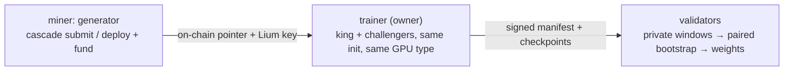

<p align="center">
  
</p>

# cascade: SOTA time-series foundation models on Bittensor

cascade builds time-series foundation models on Bittensor by competing on
**data**. The model is fixed and byte-identical for everyone; miners write the
synthetic data generators that train it. Better data trains a better
forecaster, and that is measured every round on private real-world windows.

- Miners: [docs/MINER.md](docs/MINER.md) (five-command version:
  [docs/MINER_FUNDED_QUICKSTART.md](docs/MINER_FUNDED_QUICKSTART.md))
- Validators: [docs/VALIDATOR.md](docs/VALIDATOR.md)
- Design: [docs/ARCHITECTURE.md](docs/ARCHITECTURE.md), decisions in `decisions/`

## Why compete on data

Recent time-series models win benchmarks through better synthetic priors, not
better architectures. Chronos-2 (Amazon) trains heavily on synthetic series and
its purely-synthetic ablation stays within a point of the full model on
GIFT-Eval ([arXiv 2510.15821](https://arxiv.org/abs/2510.15821)). FlowState
(IBM, 9.1M) out-forecasts rivals 20× its size after pretraining on CauKer
synthetic data ([arXiv 2508.05287](https://arxiv.org/abs/2508.05287)).
ForecastPFN and TempoPFN were trained on synthetic distributions only. DynaMix
beats Chronos zero-shot on real traffic and weather data with ~10k parameters
trained on 34 synthetic chaotic systems
([arXiv 2505.13192](https://arxiv.org/abs/2505.13192)). Toto 2.0 itself was
pretrained on 57.5% synthetic data.

The synthetic distribution does the heavy lifting. cascade makes that
distribution the competition.

## How it works

### The fixed model

A Toto2-4M backbone ([Datadog/Toto-2.0-4m](https://huggingface.co/Datadog/Toto-2.0-4m))
trained inside the subnet, never a fine-tune of released weights. Rounds
train from a shared init: random at generation 0, and since promotions
started firing, the promoted checkpoint of the previous generation (see
[the cascade](#the-cascade-promoted-generations)). Every learned parameter
was produced by the competition, so the corpus is the only source of signal.

Toto 2.0 is the first time-series family with a clean scaling law across
sizes (4M → 2.5B) under u-μP, so hyperparameters tuned at 4M transfer up the
ladder. The 4M rung trains from scratch in hours and sits on a curve known
to behave; the 22M rung is a built, dormant seam in `chain.toml`.

### A round

Rounds run every 12 h (`[round] epoch_blocks = 3600`, boundaries ≈ 08:30 and
20:30 UTC).

1. **Field.** Commitments revealed before the boundary, funded by their miner
   (the miner's own Lium key pays for the training pod), seat in reveal order
   up to the round's cap. Everyone seated duels the king; there is no heat
   screen. An unfunded boundary runs nothing.
2. **Training.** King and every challenger train the full budget (~5 h,
   enforced as a fixed token count) on the same GPU type, from the same init,
   with the same seeds. The only difference between runs is the generator.
3. **Manifest.** The operator signs a manifest of checkpoints and digests to
   Hippius S3 (mirrored to R2 and a HuggingFace dataset as fallbacks).
4. **Verdict.** Validators verify the manifest's signature and contract
   digests, score king and challengers on the same private windows
   (geomean of CRPS and MASE on a 64 / 256 / 720-step horizon ladder), and
   decide the throne with a paired bootstrap.
5. **Bench.** Each checkpoint is benched on GIFT-Eval / BOOM / TIME. These
   numbers are public telemetry and feed promotion, never the verdict.



### The throne

A challenger takes the throne when the paired-bootstrap lower confidence
bound of its advantage clears the round's margin: 1% against a fresh king,
decaying to a 0.5% floor over 8 held rounds. With several challengers a
cohort-wide max-T correction keeps the king's false-dethrone risk fixed. From
block 9046800 the margin is priced against the per-round improvement over the
shared init, so a mature lineage stays dethronable.

Weights follow geometric decay across the lineage: the king plus up to 4
prior kings share ∝ `0.5**i` (≈ 52 / 26 / 13 / 6 / 3 %). Unregistered share
burns.

### Private code, public kings

Miners can submit code privately (`cascade submit`): it lives in the
operator's vault and trains on the miner's own pod. Only a king is published,
the moment it is crowned (`champion_publish = "crown"`), to `champions/` on
the manifest bucket; `cascade fetch king` resolves it. Losers stay private.

### Multivariate data

Generators may yield `(C, L)` series with up to 32 coupled channels. A channel
costs what it trains, step count is independent of width, and from block
9068400 multivariate eval windows are scored jointly.

## The cascade: promoted generations

When a king holds 5 consecutive rounds (`cascade_reign_rounds`), up to 3
(`cascade_top_k`) of the reign's best duel checkpoints, king's or
challengers', are promoted as the next warm-start generation. Members are
picked by the geometric mean of six signed benchmark numbers (GIFT-Eval /
BOOM / TIME × CRPS / MASE), within 5% of the reign's best, for error
diversity. Later rounds rotate through them. A promotion never ratchets
downhill, the king persists (only the reign clock resets), and each promotion
is a signed public record under `promotions/`. Generations have been promoted
on mainnet; warm-started rounds are the live case.

## Roadmap

- **Phase 1, now: compete on data.** Model fixed, data is the variable.
- **Phase 2: prove it scales.** Show the data advantage survives model size
  using the u-μP ladder (the `throne_sizes` seam pools verdicts across sizes).
- **Phase 3: open model training.** Widen the contract once data quality is a
  solved, measurable axis.
- **North star: multimodal forecasting** across time series, language and
  vision.

## Repository

```
cascade/
  interface/   the DataGenerator contract, output checks, static guard
  eval/        CRPS (MWSQL), MASE, paired bootstrap, KOTH decision, checkpoint guard
  trainer/     owner GPU service: corpus, contract, training, manifest, funded legs
  validator/   manifest gate, evaluator, KOTH state, weights, cascade promotion
  miner/       miner CLI
  funding/     intake service, funded queue, payer-key vault
  provision/   GPU pod rental (Lium), bootstrap, ledger
  audit/       cascade-audit: re-derive published rounds
  pool/        private eval-window pool
  shared/      config, Hippius Hub/S3, chain client, manifest schema
  website/     the public dashboard (index.html)
docs/
  MINER.md, MINER_FUNDED_QUICKSTART.md   miners
  INTERFACE.md                           the submission contract
  VALIDATOR.md, ARCHITECTURE.md, AUDIT.md, EVAL_POOL.md, DEPLOY_PODS.md
  MINER_FUNDED_ROUNDS.md                 operator runbook for funded rounds
scripts/example_generator/               a forkable reference generator
```

## Commands

Miner (`cascade`, no GPU):

- `verify <dir>`: every check the trainer runs, including determinism.
- `score <dir> --pool-dir <windows>`: train at a cheap budget and score
  locally; `--warm-start live` uses the current round's init.
- `submit <dir> <intake-url>`: private submission, on-chain commit and funding
  in one request.
- `deploy <dir>`: push to a public Hippius Hub repo and commit on-chain;
  then `fund <intake-url> --ref <repo@digest>` pays for the leg.
- `queue`, `round`, `heat`, `duel`, `reveal-status`: the live queue and
  roster, the round countdown and dethrone bar, who seated, the settled
  verdict (`duel --hotkey <you>`: which domains you beat the king in and by
  how much), and whether your reveal landed.
- `fetch king | <uid> | <hotkey> | <repo@digest>`: download a public
  generator.

Operator and validator:

- `cascade-trainer`: the training service (`--offline` for a config smoke,
  `--remote-hosts` for SSH GPU pods).
- `cascade-train-worker`: the per-pod worker.
- `cascade-intake`: the funding and private-submission intake.
- `cascade-validator`: the validator loop.
- `cascade-audit latest | round <id>`: re-derive a published round from its
  public artifacts, nonzero exit on any mismatch.

## Storage and public records

Generators and checkpoints live on the Hippius Hub registry (OCI, pinned by
`repo@digest`). Manifests, receipts, logs and benchmark reports live on
Hippius S3, dual-written to Cloudflare R2, with a HuggingFace dataset as the
read fallback for manifests and checkpoints. Credentials are environment
only (`HIPPIUS_*`, `HF_TOKEN`), never in files.

```
manifests/round-<id>.json          the trainer's signed manifest
receipts/<hotkey>/round-<id>.json  a validator's signed receipt (scores, verdict, weights)
receipts/index.json                rolling summary the dashboard reads
funded/round-<id>.json             seat order, GPU capacities, outcomes
benchmarks/round-<id>.json         signed public benchmark numbers
champions/                         published kings
promotions/                        signed warm-start promotions
```

`cascade-audit latest` re-derives a receipt without trusting the operator.
The dashboard (`cascade/website/index.html`) reads only these public records.
Every throne-holding generator is also archived to a private bucket by
`scripts/scrape_kings.py`.

## Quick start (development)

```bash
pip install -e '.[dev]'
python -m pytest tests/unit -q      # CPU only, no torch/chain needed
```

Extras: `.[train]` (torch, the trainer and evaluator), `.[hippius]` (registry
and S3), `.[chain]` (bittensor). `chain.toml` ships mainnet values (netuid 91,
worker image digest, pool bucket); operator-specific values are set on the
deployment box.

## License

MIT
